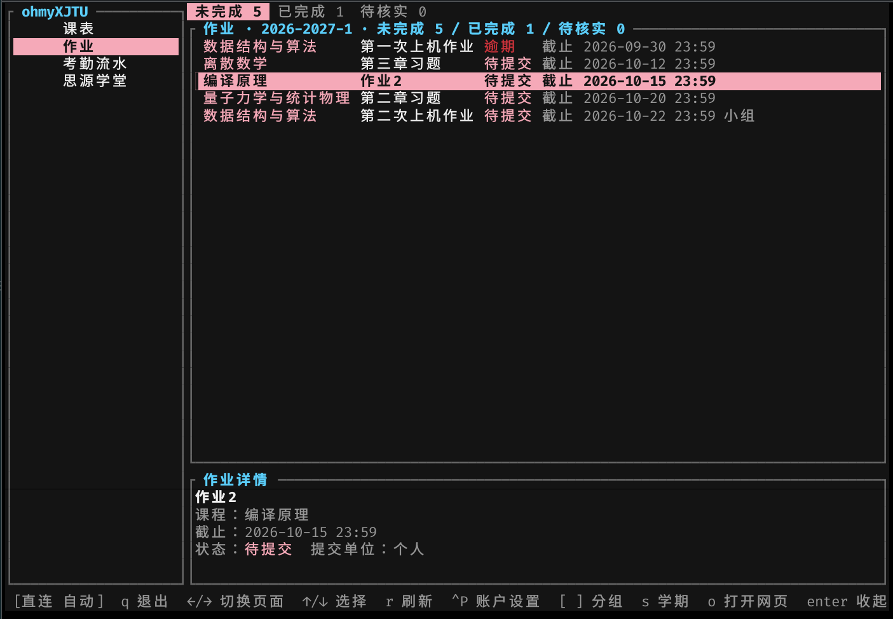

> [!WARNING]
> 本软件为个人独立开发，**不保证任何查询结果的正确性，也不代表、不接受、不提供任何形式的背书**，使用前请仔细阅读[用户协议](PRIVACY.md)。

# ohmyXJTU

西安交通大学工具箱（TUI）：查询课表与考勤状态、查看考勤流水、汇总思源学堂待提交作业。



## 功能

- 本周课程与考勤标记
  - 本周课程与考勤一屏掌握，异常一目了然；
- 考勤流水
  - 快速核对考勤流水；
- 思源学堂作业汇总
  - 自动读取并解析所有作业，包含作业说明，您无需移步思源学堂查看作业内容；
  - 按完成状态清晰分类并标注截止日期，让您对进度与期限了如指掌；
- 自定义任务
  - 任务不在思源学堂发布？动动手指，快速添加；
  - 可包含：标签、描述、截止日期、优先级；
  - 所有任务汇于一页，无需来回切换；
- 任务页面排序与搜索
  - 按标签快速筛选，一类任务一网打尽；
  - 按截止日期或优先级排序，轻重缓急一目了然；
- 坚果云同步（可选，默认关闭）
  - 把**已加密**的账号密码与自定义任务同步到您自己的坚果云 WebDAV，多台终端共用同一加密口令即可查看与编辑；
  - 登录界面按 `Ctrl+Y` 从坚果云导入，或在账户设置中配置；支持手动上传／下载、智能同步与自动上传；
- 思源学堂课程汇总
  - 各门课程一览无余，一键跳转课程回放，学习快人一步；
- 按「o」跳转至对应网页
  - 作业说明显示不全？需要看课程回放？按「o」一键开启浏览器，跳转对应网页。

## 安装

- 使用 `cargo` 安装：
```shell
cargo install ohmyXJTU
```

- 下载预编译的最新版本：
[](https://github.com/TiaoFeng/ohmyXJTU/releases/latest)

或从源码构建（见下方「从源码构建」章节）。

## 使用手册

| 按键 | 作用 |
| --- | --- |
| `←` `→` / `Tab` | 切换左侧页面 |
| `↑` `↓` / `j` `k` | 选择列表项 |
| `Enter` | 查看详情／进入下一层 |
| `Esc` | 收起详情／返回上一层 |
| `r` | 重新加载当前页面 |
| `[` / `]` | 课表切换周次；考勤流水翻页；任务页、思源学堂活动页切换分组 |
| `Ctrl+P` | 账户设置（含坚果云同步） |
| `Ctrl+Y` | 登录／解锁界面：从坚果云导入（`^t` 测试连接 · `Enter`／`^s` 导入） |
| `q` / `Ctrl+C` | 退出 |

任务页（自定义任务）另有一组按键：

| 按键 | 作用 |
| --- | --- |
| `Ctrl+A` | 新增自定义任务 |
| `Ctrl+E` | 修改选中的自定义任务 |
| `Space` | 标记／取消标记选中的自定义任务为已完成（多选模式下为勾选） |
| `Ctrl+D`（连按两次） | 删除选中的自定义任务 |
| `Ctrl+F` | 按关键字筛选（同时作用于任务与作业；输入框内 `↑`/`↓` 可在已用过的标签间循环预填） |
| `m` | 进入／退出多选模式 |
| `Ctrl+T` | 任务设置（多选批量操作、删除所有已完成的任务） |
| `Ctrl+L` | 排序（`p` 按优先级、`d` 按截止时间、`n` 恢复默认；`Esc` 取消） |
| `Enter` | 查看详情；多选模式下打开批量操作菜单 |

> **说明**
> - 自定义任务保存在本地，并以您的加密口令加密（见 `PRIVACY.md`）：与账号无关，**换账号不会清空任务**。每个自定义任务可以带一个标签（最多 6 个汉字宽）：新增／修改任务时在「标签」字段输入。
> - 首次启动会要求设置加密口令并输入账号与密码。若统一认证要求图片验证码或短信验证码，界面会给出验证码图片路径或提示短信已发送，按提示输入即可；登录态失效时会自动重新登录并重试当前查询。
> - 解锁后程序会**自动在后台登录**考勤系统与思源学堂，并预载四个页面的数据（课表与本周考勤、考勤流水、思源学堂课程列表、本学期作业汇总）
> - 预载失败会在底栏提示，对应页面保持未载入，进入该页时会重新查询；网络请求因超时或无法连接而失败时会自动重试，最多共 3 次尝试后报错。

## 访问模式

| 模式 | 行为 |
| --- | --- |
| 自动（默认） | 探测校园网；校外访问考勤系统时经 WebVPN 转发，思源学堂为云端服务仍直连 |
| 直连 | 始终直接访问（需在校园网内） |
| WebVPN | 始终经 `webvpn.xjtu.edu.cn` 转发 |

## 安全说明

> [!WARNING]
> 账号与密码在本机**加密保存**，但**不保证抗攻击、不保证抗木马**

- 数据保存：
  - 账号与密码以 Argon2id 派生密钥配合 ChaCha20-Poly1305 认证加密后保存于
  `~/.local/share/ohmyXJTU/credentials.vault`（权限 `0600`，目录 `0700`），磁盘上不存在明文密码。
  - 自定义任务以同一口令加密保存于同目录的 `tasks.vault`（同样 `0600`）。
  - 启用坚果云同步后，会将上述**已加密**的 `credentials.vault`／`tasks.vault` 上传到您指定的 WebDAV 服务器；上传的是密文，程序不会上传明文密码、加密口令或坚果云应用密码（详见 `PRIVACY.md` §5.10）。同步配置存于同目录的 `sync.vault`（同样加密、`0600`）。
- 首次使用必须设置加密口令（至少 8 个字符）；之后每次启动都需解锁，修改账号或口令都必须先验证原口令。
- 提交给统一认证前，密码会以 RSA（PKCS#1 v1.5）加密；日志与界面不输出密码、口令或会话 token。

## 从源码构建

```bash
git clone https://github.com/TiaoFeng/ohmyXJTU.git
cd ohmyXJTU
cargo build --release
# 产物: target/release/ohmyXJTU
```

## 开发规范

贡献流程见 [贡献指南](CONTRIBUTING.md)。

## 协议
- 本项目使用 [BSD 3-Clause License](LICENSE) 开源。
- 使用前请仔细阅读 [用户协议](PRIVACY.md)。

## 其它
- 项目使用 GPT-6，DeepSeek-V4.1-Flash 构建。
- 实现参考 [XJTUToolBox](https://github.com/yan-xiaoo/XJTUToolBox)。
- [opencode](https://github.com/anomalyco/opencode) 提供优秀、开源的工具。
